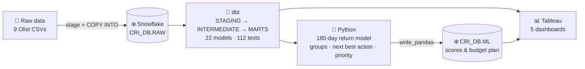

# Customer Retention Intelligence Platform

**An end-to-end analytics project that finds an e-commerce marketplace's most valuable customers, detects who is
slipping away, and ranks who to contact first, with what action, on a limited marketing budget.**

Snowflake · SQL · dbt · Python (pandas, scikit-learn) · Tableau · Git/GitHub
Data: [Olist Brazilian E-Commerce](https://www.kaggle.com/datasets/olistbr/brazilian-ecommerce), ~100k real orders, 2016-2018

> 📊 **Interactive dashboard:** `[INSERT Tableau Public link]`
>
> `[INSERT screenshot: docs/images/dashboard/01_executive_overview.png]`

---

## Business problem

> **Which customers are most valuable, which are becoming inactive, and which should the company prioritise for retention?**

Acquiring customers is expensive, yet most marketplace buyers never return. The marketing team needs to know where
a limited retention budget will matter most, and what to offer each customer. [More context →](docs/business_problem.md)

## Key findings

| # | Finding | Evidence |
|---|---|---|
| 1 | **Retention is a "second purchase" problem.** 97.8% of customers bought on only one day; only **2.0%** buy again within 180 days of their first purchase. | Customer features, cohort analysis |
| 2 | **Value is concentrated.** The top 20% of customers generate **54%** of revenue (R$ 15.74M total, 98,207 orders, 94,990 customers, AOV R$ 160.27). | `kpi_summary`, revenue concentration |
| 3 | **A quarter of revenue sits with high-value customers at risk.** 9,135 "High Value – High Risk" customers account for **26.5%** of historical revenue; 7,292 high-value customers have been quiet for 6-12 months. | `customer_rfm`, model risk tiers |
| 4 | **Experience, not spend, predicts a return.** Late deliveries average **2.27★ vs 4.29★** on time. Recency, repeat behaviour and review score are the model's consistent drivers; total spend is not. | Order data, model odds ratios |
| 5 | **Returns are predictable, but only modestly.** The model's top 10% return **2.0×** more often than average (ROC-AUC 0.59), slightly ahead of a classic RFM ranking (1.9×). Good for ranking, not individual promises. | Out-of-time test, 56,630 customers |
| 6 | **When customers come back, they do it fast.** 56% of real repeat purchases happen within 90 days, 77% within 180. And 30% of "repeat" orders are same-day split baskets, not loyalty. | Order history |

## Recommendations

1. **Make the second purchase the core retention KPI.** Send the *second-purchase incentive* to the 17,130 new customers
   within 30-60 days of delivery, when most returns happen. Track month-1 and month-3 cohort retention (month-1 is ~0.5% today).
2. **Protect high-value customers before they go cold.** Start with a **R$ 25,000 pilot** on the priority list:
   2,223 customers, 2,213 of them high-value, together 7.8% of historical revenue.
3. **Fix the experience before discounting.** Give *service recovery* to the 8,415 valuable customers who left 1-2★ reviews,
   and work with sellers and logistics on late deliveries (6.8% of delivered orders), which cost about 2 review stars.
4. **Prove impact with controlled tests.** Hold out 10-20% of each action group as a control and measure the extra return rate.
   The model predicts *who* returns, not who returns *because of* an offer.
5. **Match spend to value.** Use the low-cost email channel for the 31,001 low-value customers and reserve vouchers for
   high-value groups. Review low-rated categories (e.g. office_furniture, 3.62★) with category managers.

---

## Architecture



| Layer | Tool | What it does | Details |
|---|---|---|---|
| Ingestion | Snowflake + SQL | Load 9 CSVs 1:1 into `RAW`; validate row counts, nulls, duplicates, types, relationships | [Runbook](docs/runbook_sprint_1_snowflake.md) · [Results](docs/sprint_1_results.md) |
| Transformation | dbt | Clean and model the data: order facts, a customer model, RFM, KPIs, cohort retention | [Models explained](docs/dbt_models.md) · [Results](docs/sprint_2_results.md) |
| Intelligence | Python | Leakage-safe return model, value × risk groups, next best action, priority score, budget plan | [Methodology](docs/sprint_3_methodology.md) |
| Presentation | Tableau | Executive, segmentation, retention, opportunity and prioritisation dashboards | [Dashboard spec](docs/tableau_dashboard_spec.md) |

## Tools used

| Tool | Used for |
|---|---|
| **Snowflake** | Warehouse, internal stage, `COPY INTO`, key-pair authentication |
| **SQL** | Data quality checks, independent recalculation of every key metric |
| **dbt Core 1.12** | 22 staging/intermediate/mart models, 112 tests, documentation, lineage |
| **Python** | pandas (features), scikit-learn (logistic regression), matplotlib (charts), Snowflake connector |
| **Tableau** | Dashboards (Tableau Public via CSV export, or live Snowflake via Desktop/Cloud) |
| **Git / GitHub** | Version control; secrets and raw data kept out of the repo |

## Methodology

1. **Load & validate (SQL).** 9 RAW tables, ~1.55M rows, all row counts matching the files; 0 failures across 5 validation scripts, with known data quirks documented.
2. **Model the data (dbt).** The key decision: a customer is `customer_unique_id`, because `customer_id` changes with every order.
   Items, payments and reviews are rolled up to the order *before* joining, so revenue isn't double-counted.
   Revenue is reconciled to the cent against an independent SQL recalculation.
3. **Segment (dbt).** RFM scores: recency and monetary by quintile; frequency in fixed buckets, because 97% of customers bought once.
   Nine segments, a high-value flag, and Active / Cooling / Inactive status (180 and 365 days, backed by the repeat-gap distribution).
   Monthly cohort retention grid for the retention dashboard.
4. **Predict (Python).** Target: *"Will the customer buy again in the next 180 days?"* (no churn label exists).
   Time-travel snapshots: features use only information known at each date; train on 2017, test on 2018.
   Logistic regression with 9 features, compared with recency and RFM rules.
5. **Decide (Python).** Value tier × risk tier → 7 customer groups → next best action (with a service-recovery override) →
   0-100 priority score (45% value, 35% return likelihood, 20% urgency) → budget allocation by cumulative cost.
6. **Present (Tableau).** Five dashboards answering one question each. See the [spec](docs/tableau_dashboard_spec.md).

**Observations, rules and predictions are kept separate.** Spend and recency are *observed*; tiers, groups and actions are
business *rules*; return probability is a *prediction*. No customer is labelled "churned".

## Limitations

- **No churn label.** The model predicts a purchase within 180 days; silence is not proof of churn.
- **Weak, rare signal.** ~2% of customers ever return; ROC-AUC 0.59. Use the scores to rank, not as exact probabilities.
- **No uplift.** Without campaign history, the effect of an offer can't be measured. That needs an A/B test.
- **Missing drivers.** No marketing, browsing, demographic, margin or customer-service data.
- **Illustrative costs.** Action costs (R$ 0.10-25) are placeholders.
- **Historical data.** The data ends in 2018; scores are "as of 2018-09-04".

## Future improvements

- **A/B test + uplift model** to target customers whose behaviour an offer actually changes.
- **Time-to-next-purchase models** (survival analysis, BG/NBD + Gamma-Gamma CLV) for probability-weighted lifetime value.
- **Category-affinity cross-sell** recommendations using order-item co-occurrence.
- **Streamlit app** for the marketing team: searchable priority list with a budget slider, written to Snowflake.
- **Automation:** scheduled `dbt build` + scoring (Snowflake Tasks or Airflow), GitHub Actions CI running dbt tests on every pull request.

---

## Reproduce the project

**Prerequisites:** Python 3.10+, a Snowflake account (the free trial works), a Kaggle account, and Tableau Public or Desktop.

```bash
git clone https://github.com/<your-username>/customer-retention-intelligence-platform.git
cd customer-retention-intelligence-platform
python3 -m venv .venv && source .venv/bin/activate
pip install -r requirements.txt
```

| Step | Command / action | Guide |
|---|---|---|
| 1. Data | Download the Kaggle dataset → `data/raw/`; run `python python/inspect_dataset.py` | [data/README.md](data/README.md) |
| 2. Snowflake | Run `snowflake/01…04` scripts, upload CSVs to the stage, run validations `05…09` | [Sprint 1 runbook](docs/runbook_sprint_1_snowflake.md) |
| 3. Connection | Create a key pair, register the public key, write `~/.dbt/profiles.yml` and `.env` (from `.env.example`) | [Sprint 2 runbook](docs/runbook_sprint_2_dbt.md) |
| 4. dbt | `cd dbt && dbt build`, then run `snowflake/05_dbt_validation/10_validate_dbt_models.sql` | [dbt models](docs/dbt_models.md) |
| 5. Python | `python python/run_sprint3.py`, then run `snowflake/06_ml_validation/11_validate_retention_scores.sql` | [Methodology](docs/sprint_3_methodology.md) |
| 6. Tableau | `python python/export_tableau_data.py`, then build from the spec | [Dashboard spec](docs/tableau_dashboard_spec.md) |

Expected results: dbt **PASS = 134, 0 errors**; validation SQL all **PASS**; Python **6/6 checks PASS** and 5 tables in `CRI_DB.ML`.

## Repository structure

```
├── README.md
├── requirements.txt · .env.example · .gitignore
├── data/                   # how to get the data (raw CSVs git-ignored)
├── snowflake/              # SQL: setup, DDL, load, validation (01-11, run in order)
├── dbt/                    # dbt project: staging / intermediate / marts, tests, macros
├── python/
│   ├── inspect_dataset.py      # profile CSVs before loading
│   ├── upload_to_stage.py      # optional: upload CSVs to Snowflake
│   ├── run_sprint3.py          # retention intelligence pipeline (one command)
│   ├── export_tableau_data.py  # Tableau data sources → tableau/data/
│   └── retention/              # features, model, actions, charts, config
├── tableau/                # Tableau notes (+ workbook when built)
└── docs/                   # methodology, results, runbooks, data dictionary, charts
```

## Documentation

| Document | Contents |
|---|---|
| [business_problem.md](docs/business_problem.md) | Problem, sub-questions, success criteria |
| [dataset_overview.md](docs/dataset_overview.md) · [data_dictionary.md](docs/data_dictionary.md) · [data_model.md](docs/data_model.md) | Source data, every column, ER diagram |
| [sprint_1_results.md](docs/sprint_1_results.md) | Data quality findings |
| [dbt_models.md](docs/dbt_models.md) · [sprint_2_results.md](docs/sprint_2_results.md) | Every dbt model in plain language; reconciliation |
| [sprint_3_methodology.md](docs/sprint_3_methodology.md) | Model, leakage prevention, metrics explained, rules, assumptions |
| [tableau_dashboard_spec.md](docs/tableau_dashboard_spec.md) | Every dashboard view: chart, fields, filters, question |
| [portfolio_kit.md](docs/portfolio_kit.md) | Resume bullets, interview pitch, LinkedIn text |

## Data licence
Olist dataset © Olist, licensed [CC BY-NC-SA 4.0](https://creativecommons.org/licenses/by-nc-sa/4.0/). Raw data is not redistributed in this repository.

**Author:** `[INSERT your name]` · `[INSERT LinkedIn URL]`
