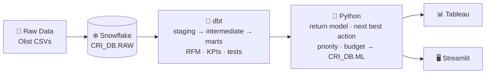
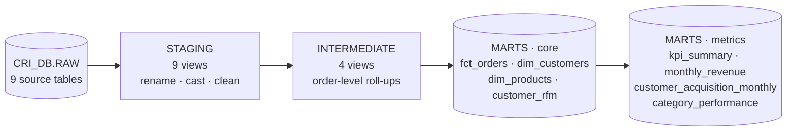

# Customer Retention Intelligence Platform

An end-to-end analytics project that identifies an e-commerce company's most valuable customers,
detects who is becoming inactive, and prioritises who to target for retention.

**Stack:** Snowflake · SQL · dbt · Python · Tableau · Streamlit · Git/GitHub
**Data:** [Olist Brazilian E-Commerce Public Dataset](https://www.kaggle.com/datasets/olistbr/brazilian-ecommerce) (~100k real orders, 2016–2018)

---

## Business problem

> **Which customers are most valuable, which are becoming inactive, and which customers should the company prioritize for retention?**

Details, metrics and assumptions: [docs/business_problem.md](docs/business_problem.md)

## Architecture



More detail: [docs/architecture.md](docs/architecture.md)

## Project structure

```
customer-retention-intelligence-platform/
├── README.md
├── .gitignore
├── .env.example                 # template for Snowflake credentials (real .env is git-ignored)
├── requirements.txt
├── data/
│   ├── README.md                # how to download the dataset
│   └── raw/                     # CSVs go here (git-ignored)
├── docs/
│   ├── business_problem.md
│   ├── architecture.md
│   ├── dataset_overview.md      # why this dataset, key columns, quirks
│   ├── data_model.md            # ER diagram + table grains
│   ├── data_dictionary.md       # every column, type, key, description
│   ├── validation_results.md    # Sprint 1 check results + data quality findings
│   ├── dbt_models.md            # Sprint 2: every dbt model explained + metric definitions
│   ├── sprint_2_results.md      # Sprint 2: test results, validation, headline numbers
│   ├── sprint_3_methodology.md  # Sprint 3: model, metrics explained, rules, assumptions, limitations
│   ├── images/sprint3/          # Sprint 3 charts (generated)
│   └── dataset_profile.md       # generated by python/inspect_dataset.py
├── python/
│   ├── inspect_dataset.py       # profile CSVs + verify columns before loading
│   ├── upload_to_stage.py       # optional: PUT files to Snowflake stage
│   ├── run_sprint3.py           # Sprint 3 pipeline: one command, 7 steps
│   └── retention/               # Sprint 3 modules
│       ├── config.py            #   every assumption & threshold in one place
│       ├── snowflake_io.py      #   key-pair connection, read/write tables
│       ├── features.py          #   leakage-safe features "as of" any date
│       ├── eda.py               #   exploratory analysis + charts
│       ├── model.py             #   logistic regression, baselines, metrics
│       ├── actions.py           #   tiers, groups, next best action, priority, budget
│       └── charts.py            #   chart styling
├── snowflake/
│   ├── 01_setup/01_create_warehouse_database_schema.sql
│   ├── 02_ddl/02_create_raw_tables.sql
│   ├── 03_load/03_create_file_format_and_stage.sql
│   ├── 03_load/04_load_raw_tables.sql
│   ├── 04_validation/
│   │   ├── 05_row_count_validation.sql
│   │   ├── 06_null_checks.sql
│   │   ├── 07_duplicate_checks.sql
│   │   ├── 08_data_type_validation.sql
│   │   └── 09_relationship_checks.sql
│   ├── 05_dbt_validation/
│   │   └── 10_validate_dbt_models.sql   # recalculates dbt metrics from RAW
│   └── 06_ml_validation/
│       └── 11_validate_retention_scores.sql  # checks the Python output in CRI_DB.ML
├── dbt/                          # Sprint 2: transformation layer
│   ├── dbt_project.yml
│   ├── macros/generate_schema_name.sql
│   ├── models/
│   │   ├── staging/olist/        # 9 stg_ models + sources.yml (views)
│   │   ├── intermediate/         # 4 int_ models (views)
│   │   └── marts/
│   │       ├── core/             # fct_orders, dim_customers, dim_products, customer_rfm (tables)
│   │       └── metrics/          # kpi_summary, monthly_revenue, customer_acquisition_monthly, category_performance
│   └── tests/                    # 6 custom data-quality tests
├── outputs/      # Sprint 3 CSV exports (git-ignored)
├── tableau/      # Sprint 4
└── streamlit/    # Sprint 4
```

## Roadmap

| Sprint | Goal | Status |
|---|---|---|
| 1 | Data foundation in Snowflake | ✅ Complete — [validation results](docs/validation_results.md) |
| 2 | dbt transformation layer, KPIs & RFM | ✅ Complete — [results](docs/sprint_2_results.md) |
| 3 | Python retention model, next best action & priority | ✅ Complete — [methodology](docs/sprint_3_methodology.md) |
| 4 | Tableau dashboard & Streamlit app | ⬜ Next |

---

## Sprint 1 — Data Foundation in Snowflake

**Goal:** load the Olist dataset into Snowflake as a clean, validated RAW layer that later sprints can trust.

### Deliverables
- Raw dataset profiled and every column checked against the expected schema
- Snowflake warehouse `CRI_WH`, database `CRI_DB`, schema `RAW`
- 9 RAW tables loaded 1:1 from the source CSVs (~1.55M rows)
- Validation suite: row counts, nulls, duplicates, data types/domains, relationships
- Data model, data dictionary, architecture diagram, business problem statement

### Design decisions
| Decision | Why |
|---|---|
| Keep RAW identical to source (names, typos, order) | RAW is an audit copy. Cleaning happens in dbt where it is tested and documented. |
| Zip prefixes as `VARCHAR` | Preserve leading zeros; they're codes, not numbers. |
| `ON_ERROR = 'ABORT_STATEMENT'` | A failed row should stop the load, not be silently skipped. |
| TRUNCATE before each COPY | Re-running the load never creates duplicates. |
| X-Small warehouse, 60-second auto-suspend | Keeps trial credits low. |
| PK constraints declared but tested in SQL | Snowflake doesn't enforce them, so the duplicate checks do the enforcing. |

### How to run Sprint 1 (step by step)

#### Step 0 — Prerequisites
- A Snowflake account (a free 30-day trial at https://signup.snowflake.com is fine; any edition/cloud).
- A Kaggle account to download the data.
- Python 3.10+ and Git installed locally.

#### Step 1 — Get the data *(manual)*
Download the dataset from Kaggle and unzip the 9 CSVs into `data/raw/`. See [data/README.md](data/README.md).

#### Step 2 — Inspect the data locally
```bash
python3 -m venv .venv
source .venv/bin/activate            # Windows: .venv\Scripts\activate
pip install -r requirements.txt
python python/inspect_dataset.py
```
✅ Expect `All files present and all columns match`. Read the generated `docs/dataset_profile.md`.
If any row counts differ from the defaults in `05_row_count_validation.sql`, update that file.

#### Step 3 — Create warehouse, database, schema *(Snowsight)*
1. Log in to Snowsight → **Projects » Worksheets** (in some UI versions just **Worksheets**) → **+ SQL Worksheet**.
2. Paste `snowflake/01_setup/01_create_warehouse_database_schema.sql`, then click the **▼ next to the blue ▶ button → Run All**.
   Use the menu: plain ▶ (and in some UI versions the keyboard shortcut) runs only part of the script.
3. ✅ You should see `CRI_WH` and the `RAW` schema in the results.

#### Step 4 — Create tables, file format and stage *(Snowsight)*
Run, in order, with **Run All**:
1. `snowflake/02_ddl/02_create_raw_tables.sql` → ✅ 9 tables listed
2. `snowflake/03_load/03_create_file_format_and_stage.sql` → ✅ `FF_OLIST_CSV` and `OLIST_STAGE` exist

#### Step 5 — Upload the CSVs to the stage *(manual, pick ONE option)*
**Option A — Snowsight UI (easiest):**
1. Left menu → **Data » Databases** (called **Catalog » Database Explorer** in newer UIs) → `CRI_DB` → `RAW` → **Stages** → `OLIST_STAGE`.
2. Click **+ Files** (top right), select all 9 CSVs from `data/raw/`, click **Upload**.

**Option B — Python (repeatable):**
```bash
cp .env.example .env     # then edit .env with your account details
python python/upload_to_stage.py
```

✅ In a worksheet, `LIST @CRI_DB.RAW.OLIST_STAGE;` shows 9 files.

#### Step 6 — Load the tables *(Snowsight)*
Run `snowflake/03_load/04_load_raw_tables.sql` with **Run All**.
✅ Every COPY result shows `status = LOADED` and `errors_seen = 0`. The final query lists 9 loaded files.
If a COPY fails, read the error message: it names the file, line and column. Fix it, then re-run the file.

#### Step 7 — Validate *(Snowsight)*
Run each file in `snowflake/04_validation/` in order. Look at the `status` column:

| Status | Meaning | Action |
|---|---|---|
| `PASS` | Check succeeded | — |
| `FAIL` | Data broke a hard rule | **Stop.** Fix before Sprint 2. |
| `WARN` / `INFO` | Known real-world messiness in the source | Note the count in `docs/data_dictionary.md`. It will be handled in dbt. |

Expected `WARN`/`INFO` rows (normal for this dataset): nulls in delivery dates, product categories and
review comments; repeat `customer_unique_id`s; shared `review_id`s; duplicate geolocation rows; a few
untranslated categories; orders without items.

#### Step 8 — Commit to Git and push to GitHub
```bash
git add .
git commit -m "Sprint 1: Snowflake data foundation"
```
Then create an **empty** repo on github.com (no README or .gitignore) and push to it:
```bash
git remote add origin https://github.com/<your-username>/customer-retention-intelligence-platform.git
git push -u origin main
```

### Sprint 1 completion checklist
- [x] 9 CSVs in `data/raw/` and **not** showing in `git status`
- [x] `python python/inspect_dataset.py` reports all columns match
- [x] `CRI_WH`, `CRI_DB`, `CRI_DB.RAW` exist
- [x] 9 RAW tables created, file format and stage created
- [x] `LIST @OLIST_STAGE` shows 9 files
- [x] All 9 COPY INTO commands report `LOADED` with 0 errors
- [x] `05_row_count_validation` → all PASS
- [x] `06_null_checks` → no FAIL
- [x] `07_duplicate_checks` (Section A) → no FAIL
- [x] `08_data_type_validation` → no FAIL
- [x] `09_relationship_checks` → no FAIL
- [x] WARN/INFO counts recorded in `docs/data_dictionary.md`
- [x] No secrets committed (`.env` ignored), pushed to GitHub

---

## Sprint 2 — dbt Transformation Layer

**Goal:** turn the RAW tables into a clean, tested analytics layer with KPIs, a customer-level model and RFM segmentation.

### How dbt fits

Every model, metric definition and RFM rule is explained in plain language in **[docs/dbt_models.md](docs/dbt_models.md)**.

### Results
- `dbt build`: **21 models, 107 tests, 0 failures**
- Independent recalculation from RAW: **9/9 checks match** (revenue R$ 15,739,280.47 to the cent)
- **20.8% of customers generate 54.4% of revenue.** 7,292 high-value customers are going quiet (Priority 1).
- Full numbers: [docs/sprint_2_results.md](docs/sprint_2_results.md)

### Setup (one time)
1. Install dbt into the project environment:
   ```bash
   source .venv/bin/activate
   pip install -r requirements.txt
   ```
2. **Key-pair login** (Snowflake blocks password-only logins for tools). Create a key outside the project:
   ```bash
   mkdir -p ~/.snowflake/keys && cd ~/.snowflake/keys
   openssl genrsa 2048 | openssl pkcs8 -topk8 -inform PEM -out rsa_key.p8 -nocrypt
   openssl rsa -in rsa_key.p8 -pubout -out rsa_key.pub
   ```
   In Snowsight, register the public key (the text between the BEGIN/END lines of `rsa_key.pub`):
   ```sql
   USE ROLE ACCOUNTADMIN;
   ALTER USER <YOUR_USER> SET RSA_PUBLIC_KEY='MIIBIjAN...';
   ```
3. Create `~/.dbt/profiles.yml` (outside the repo, never committed):
   ```yaml
   cri:
     target: dev
     outputs:
       dev:
         type: snowflake
         account: <org>-<account>          # from your Snowsight URL: app.snowflake.com/<org>/<account>
         user: <YOUR_USER>
         authenticator: snowflake_jwt
         private_key_path: /Users/<you>/.snowflake/keys/rsa_key.p8
         role: SYSADMIN
         warehouse: CRI_WH
         database: CRI_DB
         schema: DBT_DEV
         threads: 4
   ```

### Daily workflow
Run from the `dbt/` folder with the virtual environment active:

| Command | What it does |
|---|---|
| `dbt debug` | Checks the connection to Snowflake |
| `dbt build` | Builds every model **and** runs every test, in dependency order |
| `dbt build --select customer_rfm+` | Rebuilds one model and everything downstream of it |
| `dbt test` | Runs the tests only |
| `dbt docs generate && dbt docs serve` | Opens a documentation website with the lineage graph |

Then run `snowflake/05_dbt_validation/10_validate_dbt_models.sql` in Snowsight (▼ → Run All). The last result should be all PASS.

### Sprint 2 completion checklist
- [x] dbt installed; `dbt debug` → All checks passed
- [x] Sources defined for all 9 RAW tables
- [x] 9 staging models (rename, cast, clean known issues)
- [x] 4 intermediate models (no row fan-out: roll up before joining)
- [x] Customer-level model `dim_customers` (one row per `customer_unique_id`)
- [x] RFM scores, segments, high-value flag, activity status, retention priority (`customer_rfm`)
- [x] KPI, monthly, acquisition and category marts
- [x] Generic tests (unique, not_null, relationships, accepted_values) + 6 custom tests
- [x] `dbt build` → 0 errors, 0 warnings
- [x] Validation SQL → all PASS against RAW
- [x] Models documented in schema.yml + docs/dbt_models.md
- [x] Committed and pushed to GitHub

---

## Sprint 3 — Customer Retention Intelligence (Python)

**Goal:** turn the customer model into decisions: who is likely to come back, who matters most, what to do with each customer, and who to contact first on a limited budget.

**Run it:** `python python/run_sprint3.py` (about 1 minute). Then run `snowflake/06_ml_validation/11_validate_retention_scores.sql` in Snowsight (▼ → Run All). Expect 12/12 PASS.

### Methodology in brief
1. **Load** valid orders, review answer dates and dbt's `CUSTOMER_RFM` from Snowflake.
2. **Explore**: 97.8% of customers bought on one day only; 30% of "repeat" orders are same-day split baskets; 77% of real returns happen within 180 days; the top 20% of customers bring 54% of revenue.
3. **Define the outcome honestly.** There is no churn label, so the model predicts *"will this customer make another purchase in the next 180 days?"*. Inactivity is an observed rule (Active ≤ 180 days, Cooling 181-365, Inactive > 365), backed by the repeat-gap distribution.
4. **Prevent leakage** with time-travel snapshots: features use only information known at each cutoff (orders placed, deliveries arrived, reviews answered). Train on 2017 snapshots, test on a later 2018 snapshot whose window the model never saw.
5. **Model:** standardised logistic regression with 9 features, compared against "most recent first" and RFM rules.
6. **Business rules:** value tier × risk tier → 7 customer groups → next best action (with a service-recovery override for 1-2 star reviewers) → 0-100 priority score → budget allocation.
7. **Write back** to `CRI_DB.ML` (5 tables) after 6 automatic output checks.

| Out-of-time test (2018-03-01 → +180 days) | ROC-AUC | Lift, top 10% | Captured by top 20% |
|---|---:|---:|---:|
| **Logistic regression** | **0.586** | **2.03×** | **31%** |
| Rule: RFM score | 0.562 | 1.93× | 30% |
| Rule: most recent first | 0.568 | 1.54× | 29% |
| Random | 0.519 | 1.06× | 21% |

**Reading it:** the signal is modest but real. The model's top 10% return twice as often as average, and the drivers are
**recency, repeat behaviour and review score, not spend**. Probabilities are used to *rank* customers, not as promises.
Every metric is explained in plain language in [docs/sprint_3_methodology.md](docs/sprint_3_methodology.md).

| Next best action | Customers | Who gets it |
|---|---:|---|
| Low-cost email campaign | 31,001 | Low-value customers |
| Second-purchase incentive | 27,174 | New customers, and medium-value at-risk customers |
| Product cross-sell | 20,041 | High/medium-value customers with lower risk |
| Service recovery | 8,415 | Valuable customers who left a 1-2 star review |
| Win-back offer | 6,644 | High-value, high-risk customers |
| Loyalty reward | 1,715 | Repeat customers who are still active or cooling |

**Budget concept:** with R$ 25,000 (illustrative costs), the priority ranking reaches 2,223 customers. 2,213 of them are high-value, representing 7.8% of all historical revenue.

### Sprint 3 completion checklist
- [x] Customer data loaded from Snowflake into Python
- [x] Exploratory analysis with 8 charts (`docs/images/sprint3/`)
- [x] Features: recency, frequency, monetary, AOV, tenure, repeat behaviour, order frequency, experience
- [x] Inactive / at-risk definitions documented, with evidence
- [x] Interpretable model (logistic regression) compared with rule baselines
- [x] Leakage prevented (as-of features, out-of-time test, asserted in code)
- [x] Evaluated with ROC-AUC, PR-AUC, lift, capture, Brier score; all explained
- [x] Value × risk customer groups, next best action, priority score, budget scenarios
- [x] Results written to `CRI_DB.ML`; 6 Python checks + 12 SQL checks pass
- [x] Assumptions and limitations documented
- [ ] Committed and pushed to GitHub

---

## Data licence
Olist dataset © Olist, licensed [CC BY-NC-SA 4.0](https://creativecommons.org/licenses/by-nc-sa/4.0/).
Raw data is not redistributed in this repository.
