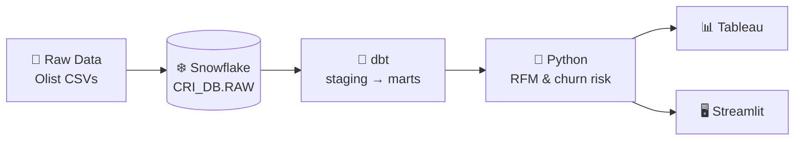

# Customer Retention Intelligence Platform

An end-to-end analytics project that identifies an e-commerce company's most valuable customers,
detects who is becoming inactive, and prioritises who to target for retention.

**Stack:** Snowflake · SQL · dbt · Python · Tableau · Streamlit · Git/GitHub
**Data:** [Olist Brazilian E-Commerce Public Dataset](https://www.kaggle.com/datasets/olistbr/brazilian-ecommerce) (~100k real orders, 2016–2018)

---

## Business problem

> **Which customers are most valuable, which are becoming inactive, and which customers should the company prioritize for retention?**

Details, metrics and assumptions: [docs/business_problem.md](docs/business_problem.md)

## Architecture



More detail: [docs/architecture.md](docs/architecture.md)

## Project structure

```
customer-retention-intelligence-platform/
├── README.md
├── .gitignore
├── .env.example                 # template for Snowflake credentials (real .env is git-ignored)
├── requirements.txt
├── data/
│   ├── README.md                # how to download the dataset
│   └── raw/                     # CSVs go here (git-ignored)
├── docs/
│   ├── business_problem.md
│   ├── architecture.md
│   ├── dataset_overview.md      # why this dataset, key columns, quirks
│   ├── data_model.md            # ER diagram + table grains
│   ├── data_dictionary.md       # every column, type, key, description
│   ├── validation_results.md    # Sprint 1 check results + data quality findings
│   └── dataset_profile.md       # generated by python/inspect_dataset.py
├── python/
│   ├── inspect_dataset.py       # profile CSVs + verify columns before loading
│   └── upload_to_stage.py       # optional: PUT files to Snowflake stage
├── snowflake/
│   ├── 01_setup/01_create_warehouse_database_schema.sql
│   ├── 02_ddl/02_create_raw_tables.sql
│   ├── 03_load/03_create_file_format_and_stage.sql
│   ├── 03_load/04_load_raw_tables.sql
│   └── 04_validation/
│       ├── 05_row_count_validation.sql
│       ├── 06_null_checks.sql
│       ├── 07_duplicate_checks.sql
│       ├── 08_data_type_validation.sql
│       └── 09_relationship_checks.sql
├── dbt/          # Sprint 2
├── notebooks/    # Sprint 3
├── tableau/      # Sprint 4
└── streamlit/    # Sprint 4
```

## Roadmap

| Sprint | Goal | Status |
|---|---|---|
| 1 | Data foundation in Snowflake | ✅ Complete — [validation results](docs/validation_results.md) |
| 2 | dbt staging & customer marts | ⬜ Next |
| 3 | Python RFM segmentation & churn-risk scoring | ⬜ |
| 4 | Tableau dashboard & Streamlit app | ⬜ |

---

## Sprint 1 — Data Foundation in Snowflake

**Goal:** load the Olist dataset into Snowflake as a clean, validated RAW layer that later sprints can trust.

### Deliverables
- Raw dataset profiled and every column checked against the expected schema
- Snowflake warehouse `CRI_WH`, database `CRI_DB`, schema `RAW`
- 9 RAW tables loaded 1:1 from the source CSVs (~1.55M rows)
- Validation suite: row counts, nulls, duplicates, data types/domains, relationships
- Data model, data dictionary, architecture diagram, business problem statement

### Design decisions
| Decision | Why |
|---|---|
| Keep RAW identical to source (names, typos, order) | RAW is an audit copy. Cleaning happens in dbt where it is tested and documented. |
| Zip prefixes as `VARCHAR` | Preserve leading zeros; they're codes, not numbers. |
| `ON_ERROR = 'ABORT_STATEMENT'` | A failed row should stop the load, not be silently skipped. |
| TRUNCATE before each COPY | Re-running the load never creates duplicates. |
| X-Small warehouse, 60-second auto-suspend | Keeps trial credits low. |
| PK constraints declared but tested in SQL | Snowflake doesn't enforce them, so the duplicate checks do the enforcing. |

### How to run Sprint 1 (step by step)

#### Step 0 — Prerequisites
- A Snowflake account (a free 30-day trial at https://signup.snowflake.com is fine; any edition/cloud).
- A Kaggle account to download the data.
- Python 3.10+ and Git installed locally.

#### Step 1 — Get the data *(manual)*
Download the dataset from Kaggle and unzip the 9 CSVs into `data/raw/`. See [data/README.md](data/README.md).

#### Step 2 — Inspect the data locally
```bash
python3 -m venv .venv
source .venv/bin/activate            # Windows: .venv\Scripts\activate
pip install -r requirements.txt
python python/inspect_dataset.py
```
✅ Expect `All files present and all columns match`. Read the generated `docs/dataset_profile.md`.
If any row counts differ from the defaults in `05_row_count_validation.sql`, update that file.

#### Step 3 — Create warehouse, database, schema *(Snowsight)*
1. Log in to Snowsight → **Projects » Worksheets** (in some UI versions just **Worksheets**) → **+ SQL Worksheet**.
2. Paste `snowflake/01_setup/01_create_warehouse_database_schema.sql`, then click the **▼ next to the blue ▶ button → Run All**.
   Use the menu: plain ▶ (and in some UI versions the keyboard shortcut) runs only part of the script.
3. ✅ You should see `CRI_WH` and the `RAW` schema in the results.

#### Step 4 — Create tables, file format and stage *(Snowsight)*
Run, in order, with **Run All**:
1. `snowflake/02_ddl/02_create_raw_tables.sql` → ✅ 9 tables listed
2. `snowflake/03_load/03_create_file_format_and_stage.sql` → ✅ `FF_OLIST_CSV` and `OLIST_STAGE` exist

#### Step 5 — Upload the CSVs to the stage *(manual, pick ONE option)*
**Option A — Snowsight UI (easiest):**
1. Left menu → **Data » Databases** (called **Catalog » Database Explorer** in newer UIs) → `CRI_DB` → `RAW` → **Stages** → `OLIST_STAGE`.
2. Click **+ Files** (top right), select all 9 CSVs from `data/raw/`, click **Upload**.

**Option B — Python (repeatable):**
```bash
cp .env.example .env     # then edit .env with your account details
python python/upload_to_stage.py
```

✅ In a worksheet, `LIST @CRI_DB.RAW.OLIST_STAGE;` shows 9 files.

#### Step 6 — Load the tables *(Snowsight)*
Run `snowflake/03_load/04_load_raw_tables.sql` with **Run All**.
✅ Every COPY result shows `status = LOADED` and `errors_seen = 0`. The final query lists 9 loaded files.
If a COPY fails, read the error message: it names the file, line and column. Fix it, then re-run the file.

#### Step 7 — Validate *(Snowsight)*
Run each file in `snowflake/04_validation/` in order. Look at the `status` column:

| Status | Meaning | Action |
|---|---|---|
| `PASS` | Check succeeded | — |
| `FAIL` | Data broke a hard rule | **Stop.** Fix before Sprint 2. |
| `WARN` / `INFO` | Known real-world messiness in the source | Note the count in `docs/data_dictionary.md`. It will be handled in dbt. |

Expected `WARN`/`INFO` rows (normal for this dataset): nulls in delivery dates, product categories and
review comments; repeat `customer_unique_id`s; shared `review_id`s; duplicate geolocation rows; a few
untranslated categories; orders without items.

#### Step 8 — Commit to Git and push to GitHub
```bash
git add .
git commit -m "Sprint 1: Snowflake data foundation"
```
Then create an **empty** repo on github.com (no README or .gitignore) and push to it:
```bash
git remote add origin https://github.com/<your-username>/customer-retention-intelligence-platform.git
git push -u origin main
```

### Sprint 1 completion checklist
- [x] 9 CSVs in `data/raw/` and **not** showing in `git status`
- [x] `python python/inspect_dataset.py` reports all columns match
- [x] `CRI_WH`, `CRI_DB`, `CRI_DB.RAW` exist
- [x] 9 RAW tables created, file format and stage created
- [x] `LIST @OLIST_STAGE` shows 9 files
- [x] All 9 COPY INTO commands report `LOADED` with 0 errors
- [x] `05_row_count_validation` → all PASS
- [x] `06_null_checks` → no FAIL
- [x] `07_duplicate_checks` (Section A) → no FAIL
- [x] `08_data_type_validation` → no FAIL
- [x] `09_relationship_checks` → no FAIL
- [x] WARN/INFO counts recorded in `docs/data_dictionary.md`
- [ ] No secrets committed (`.env` ignored), pushed to GitHub

---

## Data licence
Olist dataset © Olist, licensed [CC BY-NC-SA 4.0](https://creativecommons.org/licenses/by-nc-sa/4.0/).
Raw data is not redistributed in this repository.
