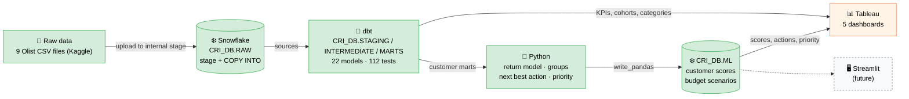

# Architecture

| Layer | Tool | Sprint | What happens |
|---|---|:---:|---|
| Raw data | CSV files | 1 ✅ | Downloaded from Kaggle, profiled with `python/inspect_dataset.py` |
| Warehouse | Snowflake | 1 ✅ | Loaded 1:1 into `CRI_DB.RAW`, validated with SQL checks |
| Transformation | dbt | 2 ✅ | Staging → intermediate → marts: clean data, KPIs, customer model, RFM, cohorts ([details](dbt_models.md)) |
| Analytics | Python | 3 ✅ | Leakage-safe return model, value × risk groups, next best action, priority score, budget plan ([details](sprint_3_methodology.md)) |
| Presentation | Tableau | 4 | 5 dashboards ([spec](tableau_dashboard_spec.md)); data via `python/export_tableau_data.py` |
| App | Streamlit | future | Marketing-facing priority list with a budget slider |

Green = built and validated. Orange = designed, built by hand in Tableau. Dashed = future improvement.

**Snowflake schemas:** `RAW` (source copy) · `STAGING`, `INTERMEDIATE`, `MARTS` (dbt-managed) · `ML` (Python output).
