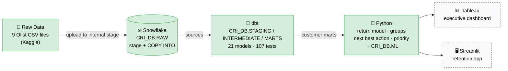

# Architecture

| Layer | Tool | Sprint | What happens |
|---|---|:---:|---|
| Raw data | CSV files | 1 ✅ | Downloaded from Kaggle, profiled with `python/inspect_dataset.py` |
| Warehouse | Snowflake | 1 ✅ | Loaded 1:1 into `CRI_DB.RAW`, validated with SQL checks |
| Transformation | dbt | 2 ✅ | Staging → intermediate → marts: clean data, KPIs, customer model, RFM ([details](dbt_models.md)) |
| Analytics | Python | 3 ✅ | Leakage-safe return model, value × risk groups, next best action, priority score, budget plan ([details](sprint_3_methodology.md)) |
| Presentation | Tableau / Streamlit | 4 | Dashboards and an interactive retention app |

Solid green = built (Sprints 1–3). Dashed = planned.
