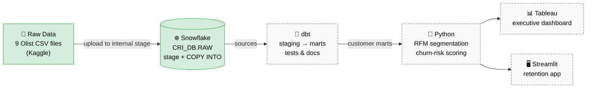

# Architecture

| Layer | Tool | Sprint | What happens |
|---|---|:---:|---|
| Raw data | CSV files | 1 ✅ | Downloaded from Kaggle, profiled with `python/inspect_dataset.py` |
| Warehouse | Snowflake | 1 ✅ | Loaded 1:1 into `CRI_DB.RAW`, validated with SQL checks |
| Transformation | dbt | 2 | Clean names, fix grains, build customer-level models |
| Analytics | Python | 3 | RFM scores, inactivity/churn-risk flags, prioritisation |
| Presentation | Tableau / Streamlit | 4 | Dashboards and an interactive retention app |

Solid green = built in Sprint 1. Dashed = planned.
