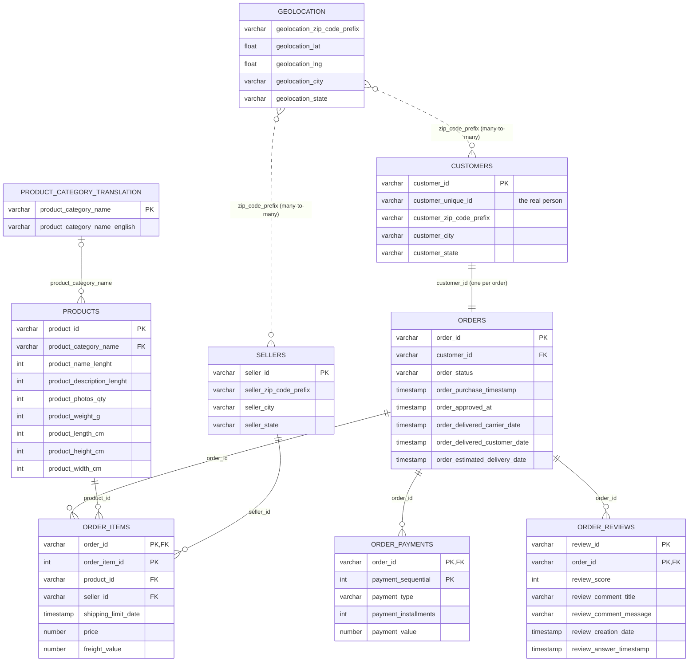

# Data Model — RAW layer

Built only from columns that exist in the source files. Keys are tested, not enforced
(Snowflake treats PK/FK as informational).



## How to read it for retention

```
customer_unique_id (person)
   └── customer_id  (one per order)
          └── ORDERS ── ORDER_ITEMS ── PRODUCTS ── CATEGORY_TRANSLATION
                 ├──── ORDER_PAYMENTS   (monetary)
                 └──── ORDER_REVIEWS    (satisfaction)
```

To get "all orders for one customer" you always go
`CUSTOMERS.customer_unique_id → CUSTOMERS.customer_id → ORDERS.customer_id`.

## Table grains

| Table | One row per… | Key |
|---|---|---|
| CUSTOMERS | order-level customer ID | `customer_id` |
| ORDERS | order | `order_id` |
| ORDER_ITEMS | item in an order | `order_id, order_item_id` |
| ORDER_PAYMENTS | payment method used on an order | `order_id, payment_sequential` |
| ORDER_REVIEWS | review–order pair | `review_id, order_id` |
| PRODUCTS | product | `product_id` |
| SELLERS | seller | `seller_id` |
| GEOLOCATION | zip-prefix sample point (not unique) | — |
| PRODUCT_CATEGORY_TRANSLATION | category | `product_category_name` |

## Why no "dimension / fact" star schema yet?
Sprint 1 is the **RAW** layer: a faithful copy of the source. The customer-level star schema
(e.g. `dim_customers`, `fct_orders`) is built in dbt in Sprint 2, on top of these tables.
