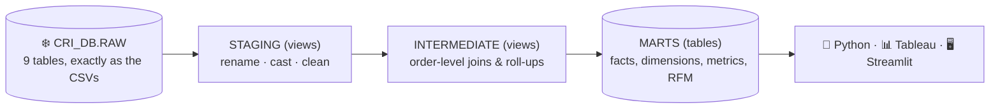

# dbt Transformation Layer — Explained

## 1. Where dbt fits

**Snowflake** stores the data and runs the SQL. **dbt** is the tool that *organises* that SQL:

- Each model is one `SELECT` statement in its own `.sql` file. dbt turns it into a view or table in Snowflake.
- Models refer to each other with `{{ ref('model_name') }}` and to RAW tables with `{{ source('olist', 'table') }}`.
  From these references dbt works out the build order (the **lineage**) automatically.
- **Tests** (in `.yml` files and the `tests/` folder) run after every build and stop bad data reaching dashboards.
- **Docs** (`description:` in `.yml`) become a browsable website with `dbt docs serve`.

Without dbt, this would be one long script you run by hand and hope is in the right order.
With dbt it is version-controlled, tested, documented and rebuilt with one command: `dbt build`.

### The three layers

| Layer | Schema | Materialized as | Rule of thumb |
|---|---|---|---|
| **Staging** | `CRI_DB.STAGING` | views | One model per RAW table. Rename, cast, fix obvious issues. **No joins.** |
| **Intermediate** | `CRI_DB.INTERMEDIATE` | views | Reusable building blocks: roll-ups and joins. Not used directly by dashboards. |
| **Marts** | `CRI_DB.MARTS` | tables | Final, business-ready tables. This is what Python, Tableau and Streamlit read. |

Views cost nothing to store and are always up to date. Marts are tables so dashboards are fast.

---

## 2. Staging models (`models/staging/olist/`)

| Model | Grain (one row per…) | What it does |
|---|---|---|
| `stg_olist__customers` | order-level customer_id | Pads zip codes to 5 digits, lower-cases city, upper-cases state. |
| `stg_olist__orders` | order | Clear date names (`purchased_at`, `delivered_at`…). **Nulls out impossible dates** (the 166 carrier dates before purchase). Adds `purchase_month`, `has_date_quality_issue` and `is_valid_purchase` (not canceled/unavailable). |
| `stg_olist__order_items` | item in an order | `price` → `item_price`, adds a single-column key `order_item_key`. |
| `stg_olist__order_payments` | payment method on an order | Fixes the 2 rows with 0 installments (→ 1). Adds `order_payment_key`. |
| `stg_olist__order_reviews` | review–order pair | Adds `review_order_key` (review_id alone isn't unique) and `has_comment`. |
| `stg_olist__products` | product | **Fixes the source typos** (`lenght` → `length`), treats weight 0 as unknown. |
| `stg_olist__product_category_translation` | category | Portuguese → English category names. |
| `stg_olist__sellers` | seller | Same location clean-up as customers. |
| `stg_olist__geolocation` | **zip prefix** | Removes the 42 points outside Brazil and averages ~1M points into one per zip prefix, ready for maps. |

## 3. Intermediate models (`models/intermediate/`)

| Model | What it does |
|---|---|
| `int_order_items__per_order` | Rolls items up to one row per order: item count, product subtotal, freight. |
| `int_order_payments__per_order` | Rolls payments up to one row per order: total paid, main payment method. |
| `int_order_reviews__per_order` | Rolls reviews up to one row per order: average score. |
| `int_orders__enriched` | **The key building block.** One row per order joining the real customer (`customer_unique_id`), money, delivery performance (days, late?) and reviews. Numbers each customer's purchases 1, 2, 3… (`customer_order_number`). |

Why separate the roll-ups? Joining items, payments and reviews to orders *before* aggregating would multiply rows.
An order with 3 items and 2 payments would appear 6 times and inflate revenue. Rolling each up to the order level first prevents that.

## 4. Mart models (`models/marts/`)

### Core: the reusable business entities

| Model | Grain | What it's for |
|---|---|---|
| `fct_orders` | order | The fact table: every order with revenue, items, delivery and review data. |
| `dim_customers` | **real customer** | **The customer-level analytical model.** First/last purchase, acquisition month, order count, total revenue, AOV, items per order, review score, late deliveries, days since last purchase, average days between purchases. |
| `dim_products` | product | Product attributes with an English category name. |
| `customer_rfm` | real customer | `dim_customers` + **RFM scores, segment, high-value flag, activity status and retention priority.** Answers the business question. |

### Metrics: one table per business question

| Model | Grain | Metrics |
|---|---|---|
| `kpi_summary` | one row | Total revenue, orders, unique customers, AOV, items per order, repeat purchase rate, purchase frequency. |
| `monthly_revenue` | month | Revenue, orders, customers, AOV, items/order, **new vs returning customers and revenue**, cumulative revenue. |
| `customer_acquisition_monthly` | acquisition month | New customers acquired, how many came back, cohort revenue. |
| `category_performance` | product category | Items, orders, customers, item revenue, share, rank, average review. |

---

## 5. Key definitions

| Term | Definition | Why |
|---|---|---|
| **Customer** | `customer_unique_id` | `customer_id` changes every order and would make every customer look new. |
| **Valid purchase** | `order_status` not `canceled` or `unavailable` | Those orders produced no sale. |
| **Revenue** | What the customer paid (`payment_value`: products + freight), per order | It's the money actually received. One order without a payment record falls back to items + freight. |
| **Category revenue** | Sum of `item_price` | Payments aren't recorded per item, so they can't be split by category. |
| **As-of date ("today")** | Last valid purchase in the data: **2018-09-03** | The data ends in 2018. Measuring from the real date would make everyone look inactive. |
| **New / returning customer (monthly)** | New = first purchase in that month; returning = first purchase in an earlier month | New + returning = unique customers, with no double counting. |
| **Repeat purchase rate** | Customers with 2+ valid purchases ÷ all customers | |

## 6. RFM: how customers are scored

| Score | Measures | How it's calculated | 5 means |
|---|---|---|---|
| **R** Recency | days since last purchase | quintiles (each ≈ 20% of customers) | bought most recently |
| **F** Frequency | number of orders | fixed buckets: 1, 2, 3, 4, 5+ orders | 5+ orders |
| **M** Monetary | total revenue | quintiles | top 20% spenders |

**Why F isn't quintiles:** about 97% of customers ordered exactly once. Quintiles would give identical customers
different F scores just to fill each bucket. Fixed buckets are honest about the data.

### Segments (first rule that matches wins)

| Segment | Rule | Meaning |
|---|---|---|
| Champions | F≥2, R≥4, M≥4 | Repeat, recent, big spenders |
| Loyal Customers | F≥2, R≥3 | Repeat buyers, reasonably recent |
| At-Risk Repeat Customers | F≥2, R≤2 | Proven repeat buyers gone quiet |
| High-Value Recent | F=1, M=5, R≥3 | Top-20% one-time spenders, still recent |
| High-Value Lapsing | F=1, M=5, R≤2 | Top-20% one-time spenders gone quiet |
| Recent One-Time Buyers | F=1, R≥4 | Bought once, recently |
| Needs Attention | F=1, R=3 | Bought once, a while ago |
| Hibernating | F=1, R=2 | Bought once, long ago |
| Lost | F=1, R=1 | Bought once, longest ago |

### Flags

- **`is_high_value`**: top 20% by spend (M=5), or a repeat customer in the top 40% (F≥2 and M≥4).
- **`activity_status`**: Active (≤180 days since last purchase), Cooling (181–365), Inactive (>365).
  Evidence: among repeat customers the median gap between purchases is 32 days and 90% buy again within ~242 days.
  So someone silent for over a year is unlikely to return. Thresholds are dbt vars in `dbt_project.yml`.
- **`retention_priority`** (rule-based v1; Sprint 3 refines it with Python):
  1 = high value & Cooling · 2 = high value & Inactive, or repeat customer going quiet · 3 = high value & Active (nurture) · 4 = everyone else.

## 7. What the data can NOT support (deliberately not built)

- **Churn probability / CLV prediction:** no churn label, and only ~3% repeat customers. Sprint 3 may explore it, clearly labelled as an estimate.
- **Profit or margin:** no cost data.
- **Marketing attribution, demographics, web behaviour:** not in the dataset.
- **Revenue by category from payments:** payments aren't itemised (item prices used instead).
- **Trends in thin months:** 2016-09, 2016-12 and 2018-09 have under 100 orders (`is_low_volume_month`). 2016-11 has none.
