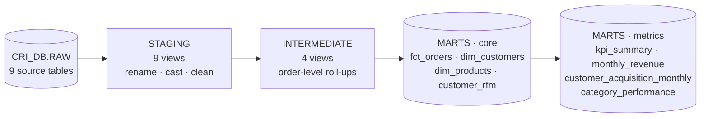

# Runbook: Sprint 2, dbt Transformation Layer

Step-by-step instructions moved here from the README.


**Goal:** turn the RAW tables into a clean, tested analytics layer with KPIs, a customer-level model and RFM segmentation.

### How dbt fits

Every model, metric definition and RFM rule is explained in plain language in **[docs/dbt_models.md](dbt_models.md)**.

### Results
- `dbt build`: **21 models, 107 tests, 0 failures** (22 models / 112 tests after Sprint 4 added `cohort_retention`)
- Independent recalculation from RAW: **9/9 checks match** (revenue R$ 15,739,280.47 to the cent)
- **20.8% of customers generate 54.4% of revenue.** 7,292 high-value customers are going quiet (Priority 1).
- Full numbers: [docs/sprint_2_results.md](sprint_2_results.md)

### Setup (one time)
1. Install dbt into the project environment:
   ```bash
   source .venv/bin/activate
   pip install -r requirements.txt
   ```
2. **Key-pair login** (Snowflake blocks password-only logins for tools). Create a key outside the project:
   ```bash
   mkdir -p ~/.snowflake/keys && cd ~/.snowflake/keys
   openssl genrsa 2048 | openssl pkcs8 -topk8 -inform PEM -out rsa_key.p8 -nocrypt
   openssl rsa -in rsa_key.p8 -pubout -out rsa_key.pub
   ```
   In Snowsight, register the public key (the text between the BEGIN/END lines of `rsa_key.pub`):
   ```sql
   USE ROLE ACCOUNTADMIN;
   ALTER USER <YOUR_USER> SET RSA_PUBLIC_KEY='MIIBIjAN...';
   ```
3. Create `~/.dbt/profiles.yml` (outside the repo, never committed):
   ```yaml
   cri:
     target: dev
     outputs:
       dev:
         type: snowflake
         account: <org>-<account>          # from your Snowsight URL: app.snowflake.com/<org>/<account>
         user: <YOUR_USER>
         authenticator: snowflake_jwt
         private_key_path: /Users/<you>/.snowflake/keys/rsa_key.p8
         role: SYSADMIN
         warehouse: CRI_WH
         database: CRI_DB
         schema: DBT_DEV
         threads: 4
   ```

### Daily workflow
Run from the `dbt/` folder with the virtual environment active:

| Command | What it does |
|---|---|
| `dbt debug` | Checks the connection to Snowflake |
| `dbt build` | Builds every model **and** runs every test, in dependency order |
| `dbt build --select customer_rfm+` | Rebuilds one model and everything downstream of it |
| `dbt test` | Runs the tests only |
| `dbt docs generate && dbt docs serve` | Opens a documentation website with the lineage graph |

Then run `snowflake/05_dbt_validation/10_validate_dbt_models.sql` in Snowsight (▼ → Run All). The last result should be all PASS.

### Sprint 2 completion checklist
- [x] dbt installed; `dbt debug` → All checks passed
- [x] Sources defined for all 9 RAW tables
- [x] 9 staging models (rename, cast, clean known issues)
- [x] 4 intermediate models (no row fan-out: roll up before joining)
- [x] Customer-level model `dim_customers` (one row per `customer_unique_id`)
- [x] RFM scores, segments, high-value flag, activity status, retention priority (`customer_rfm`)
- [x] KPI, monthly, acquisition and category marts
- [x] Generic tests (unique, not_null, relationships, accepted_values) + 6 custom tests
- [x] `dbt build` → 0 errors, 0 warnings
- [x] Validation SQL → all PASS against RAW
- [x] Models documented in schema.yml + docs/dbt_models.md
- [x] Committed and pushed to GitHub
