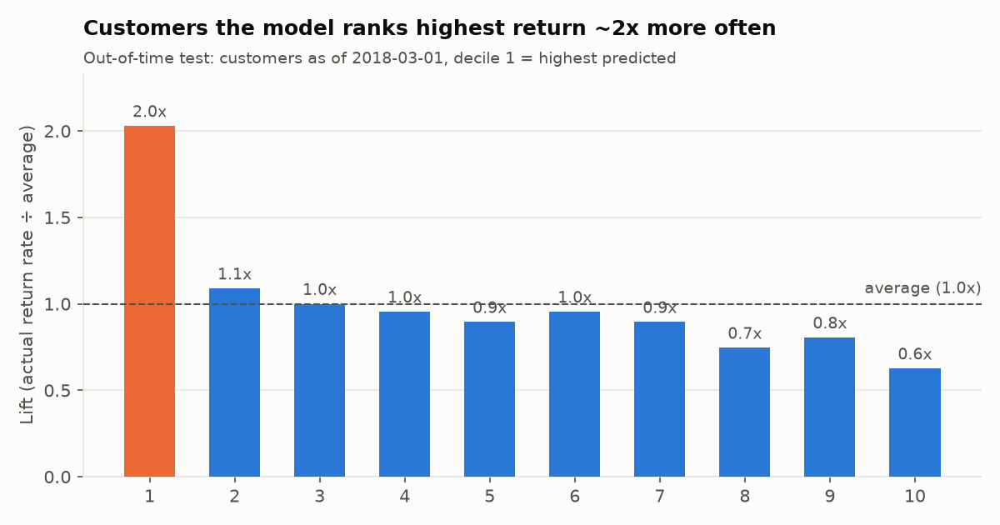
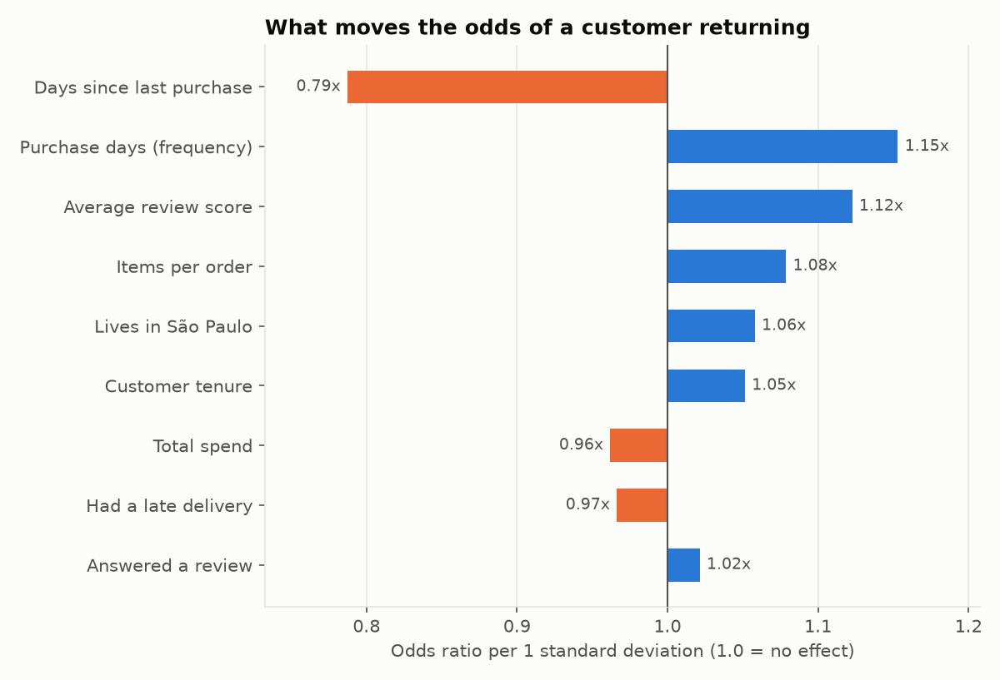
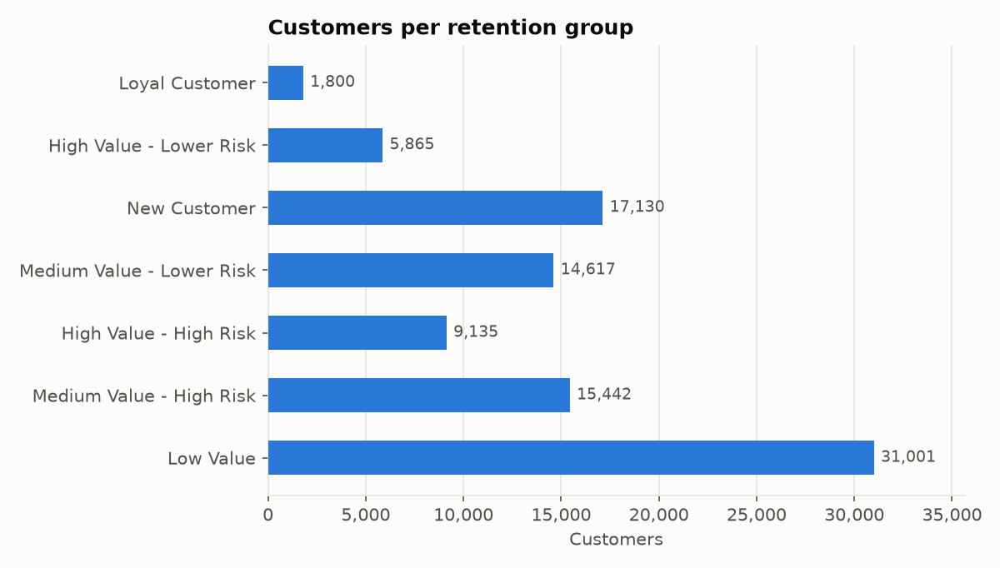

# Sprint 3 — Customer Retention Intelligence (Python)

> **Question:** Which customers are most valuable, which are becoming inactive, and which should we prioritise for retention?
>
> **Run it:** `python python/run_sprint3.py` (about 1 minute). Outputs go to `CRI_DB.ML` in Snowflake, `docs/images/sprint3/` (charts) and `outputs/` (CSVs, git-ignored).

## 0. Three kinds of information (kept separate throughout)

| Type | Meaning | Examples in the output table |
|---|---|---|
| **Observation** | Something that happened in the data | `total_revenue`, `recency_days`, `purchase_days`, `avg_review_score_observed` |
| **Rule** | A business definition *we chose*: transparent and editable | `activity_status`, `value_tier`, `customer_group`, `next_best_action`, `priority_score` |
| **Prediction** | A model's estimate about the future: uncertain | `return_probability`, `expected_revenue_180d` (and `risk_tier`, a rule built on it) |

**We never say a customer "churned".** The dataset has no cancellation or churn event. A customer who hasn't bought
for a year may still return. We only say what was *observed* (no purchase for N days) or *predicted* (chance of buying again).

---

## 1. Data loaded from Snowflake

| Source | Grain | Used for |
|---|---|---|
| `MARTS.FCT_ORDERS` (valid purchases) | order | Rebuilding customer history at any past date |
| `STAGING.STG_OLIST__ORDER_REVIEWS` | review | Review scores **with the date they were answered** (needed to avoid leakage) |
| `MARTS.CUSTOMER_RFM` | customer | dbt's RFM scores, segment, high-value flag, activity status |

## 2. Exploratory findings (observations)

| Finding | Number | Chart |
|---|---|---|
| Customers who bought on only one day | **97.8%** | `01_purchase_days_distribution.png` |
| "Repeat" orders placed the **same day** as the previous one (split baskets, not loyalty) | **30%** | |
| Real repeat purchases happening within 90 / 180 / 365 days | 56% / **77%** / 96% | `02_days_between_purchases.png` |
| Revenue from the top 20% of customers | **54%** | `03_revenue_concentration.png` |
| Return within 180 days: last purchase 0-90 days ago vs 365+ days ago | **1.5% vs 0.7%** | `04_return_rate_by_recency.png` |
| Return within 180 days: 1-star vs 5-star reviewers | 0.8% vs 1.2% (noisy) | `05_return_rate_by_review.png` |

**Why distinct purchase days instead of orders?** A customer who splits one shopping trip into two orders isn't
"loyal". Counting days gives a repeat rate of 2.2% rather than 3.0%, a more honest picture.

## 3. Definitions: inactive and at-risk (rules)

| Term | Rule | Evidence |
|---|---|---|
| **Active** | Last purchase ≤ 180 days ago | 77% of real repeat purchases happen within 180 days |
| **Cooling** | 181-365 days | Returns still happen but are getting rarer |
| **Inactive** | > 365 days | 96% of repeat purchases happen within 365 days, so a return after this is unusual |
| **At-risk** (`risk_tier = High`) | Bottom 40% of customers by predicted return probability | Relative ranking (see §6) |

"Today" is **2018-09-04**, the day after the last purchase in the data, not the real current date.

## 4. Features (observations, computed as of a date)

| Feature | Meaning | In model? |
|---|---|:---:|
| `recency_days` | Days since last purchase | ✅ (log scale) |
| `purchase_days` | Distinct days with a purchase (frequency, capped at 5) | ✅ |
| `monetary` / `total_revenue` | Total spent (BRL) | ✅ (log scale) |
| `avg_order_value` | Spend ÷ orders | ❌ (same as monetary for 98% of customers) |
| `tenure_days` | Days between first and last purchase | ✅ (log scale) |
| `is_repeat_customer` | 2+ purchase days | ❌ (already in purchase_days) |
| `items_per_order` | Basket size | ✅ |
| `avg_review_score` | Average review, only reviews **answered before** the date | ✅ |
| `has_review` | Answered at least one survey | ✅ |
| `had_late_delivery` | A delivery **that had arrived before** the date was late | ✅ |
| `is_sao_paulo` | Lives in SP (largest, best-served state) | ✅ |
| `orders_per_month_active` | Order frequency over the customer's lifetime | ❌ (descriptive) |

Also tested and **rejected** because they didn't improve the test results: average delivery days, freight share, installments, boleto payment.

## 5. The model: predicting "will they buy again in the next 180 days?"

### 5.1 How leakage is prevented (the time-travel set-up)

```
             features from history ─┐        ┌─ label: bought again?
TRAIN  2017-06-01 ──────────────────┤ cutoff ├──── 180 days ────┤
TRAIN  2017-09-01 ──────────────────┤ cutoff ├──── 180 days ────┤ 2018-02-28
TEST   2018-03-01 ──────────────────┤ cutoff ├──── 180 days ────┤ 2018-08-28   (never seen in training)
SCORE  2018-09-04 ──────────────────┤ cutoff ├──── future (unknown) ───>
```

**Data leakage** means accidentally letting the model see information it wouldn't have at prediction time.
The model then looks great in testing and fails in real life. It's prevented by:
1. **Features only use the past.** Orders before the cutoff, deliveries that had *arrived*, reviews that had been *answered*.
   Even the value used to fill missing reviews is the average known at that date.
2. **Out-of-time test.** The model is trained on 2017 snapshots and tested on a 2018 snapshot. Every training label
   window ends (2018-02-28) **before** the test snapshot starts (2018-03-01). The code asserts this.
3. **No outcome-derived features.** dbt's `days_since_last_purchase` (measured at the *end* of the data) is never a training feature.

### 5.2 Why logistic regression
It produces a **probability** and **one coefficient per feature** that a Business Analyst can read
("each extra purchase day raises the odds of returning by X%"). With only ~1,200 returners in the labelled
data, a complex model (e.g. gradient boosting) would mostly learn noise and be hard to explain.
Features are standardised, so coefficient sizes are comparable. No class re-weighting is used, so probabilities stay realistic.

### 5.3 Evaluation (out-of-time test: 56,630 customers, 670 returned = 1.18%)

| Approach | ROC-AUC | PR-AUC | Lift, top 10% | Captured by top 20% |
|---|---:|---:|---:|---:|
| **Logistic regression** | **0.586** | **0.031** | **2.03×** | **31.2%** |
| Rule: most recent first | 0.568 | 0.016 | 1.54× | 29.1% |
| Rule: RFM score | 0.562 | 0.023 | 1.93× | 30.0% |
| Random (no model) | 0.519 | 0.013 | 1.06× | 21.3% |

**What each metric means:**

| Metric | Plain-language meaning | How to read our result |
|---|---|---|
| **Base rate** | Share of customers who actually returned | 1.18%. Returning is rare, so accuracy is useless (predicting "nobody returns" is 98.8% "accurate") |
| **ROC-AUC** | Pick one returner and one non-returner at random: how often does the model rank the returner higher? 0.5 = coin flip, 1.0 = perfect | 0.59: better than chance, but a **weak** signal |
| **PR-AUC** (average precision) | How "pure" the top of the ranked list is. Compare it to the base rate | 0.031 vs 0.012 base: the top of the list is ~2.6× purer than random |
| **Lift (top 10%)** | Return rate among the top-ranked 10% ÷ overall return rate | 2.0×: target the model's top 10% and you reach twice as many returners as random targeting |
| **Capture (top 20%)** | Share of all returners found by contacting the top 20% | 31% of returners from 20% of the list (random would find 20%) |
| **Brier score** | Average squared error of the probabilities (lower = better). Compare to always predicting the base rate | 0.0116 vs 0.0117: probabilities are only marginally better than the average. **Use them to rank, not as exact chances** |
| **Odds ratio** | How the odds of returning multiply when a feature rises by one standard deviation (1.0 = no effect) | See below |



### 5.4 What drives returning (final model, refit on all labelled snapshots)

| Feature | Odds ratio per 1 SD | Same direction when trained on 2017 only? | Interpretation |
|---|---:|:---:|---|
| Days since last purchase | 0.79 | ✅ | The longer since the last purchase, the less likely a return. **Strongest effect** |
| Purchase days (frequency) | 1.15 | ✅ | Repeat buyers are more likely to buy again |
| Average review score | 1.12 | ✅ | Happier customers return more |
| Customer tenure | 1.05 | ✅ | Longer relationships return slightly more |
| Had a late delivery | 0.97 | ✅ | Late delivery slightly lowers return odds |
| Answered a review | 1.02 | ✅ | Tiny effect |
| Items per order, São Paulo, total spend | 1.08 / 1.06 / 0.96 | ❌ | **Direction flips between fits: too weak to interpret** |



**Honest conclusion:** the model is a modest but real improvement over simple rules. It doubles the hit rate at the top of
the list, and it shows the levers are **recency, repeat behaviour and customer experience, not spend level**. The data
can't support precise individual predictions: there's no browsing, marketing or demographic data, and only 2% of customers ever return.

## 6. Business layer (rules built on observations + predictions)

### Value tier
| Tier | Rule | Customers | Historical revenue |
|---|---|---:|---:|
| High | dbt `is_high_value`: top 20% spend, or repeat buyer in top 40% | 19,715 | R$ 8.55M |
| Medium | M score 3-4 | 37,276 | R$ 5.09M |
| Low | M score 1-2 | 37,999 | R$ 2.10M |

### Risk tier (relative)
Every customer's return probability is low (median 1.0%), so risk is defined **by rank**:
High = bottom 40% of return probability, Medium = middle 40%, Low = top 20%.

### Customer groups → next best action
Rules are applied top to bottom; the first match wins.

| Group | Rule | Customers | Next best action | Cost (assumed) |
|---|---|---:|---|---:|
| Loyal Customer | 2+ purchase days and not Inactive | 1,800 | Loyalty reward | R$ 15 |
| New Customer | 1 purchase day, first purchase ≤ 90 days ago | 17,130 | Second-purchase incentive | R$ 10 |
| High Value - High Risk | value High, risk High | 9,135 | Win-back offer | R$ 25 |
| High Value - Lower Risk | value High, risk Medium/Low | 5,865 | Product cross-sell | R$ 2 |
| Medium Value - High Risk | value Medium, risk High | 15,442 | Second-purchase incentive | R$ 10 |
| Medium Value - Lower Risk | value Medium, risk Medium/Low | 14,617 | Product cross-sell | R$ 2 |
| Low Value | everyone else | 31,001 | Low-cost email campaign | R$ 0.10 |
| *Override* | avg review ≤ 2 stars and value High/Medium | 8,415 | **Service recovery** | R$ 20 |

The override exists because sending a discount to someone who just gave a 1-star review is the wrong first message.



### Priority score (0-100)
```
priority_score = 100 × (0.45 × value percentile  +  0.35 × return-likelihood percentile  +  0.20 × urgency)
urgency: Cooling = 1.0, Active = 0.6, Inactive = 0.3
```
- **Value (45%)**: there's more to lose with big spenders.
- **Likelihood (35%)**: spend the budget where a response is realistic.
- **Urgency (20%)**: Cooling customers are slipping away *now*; Inactive ones are harder to win back.

Trade-off, stated openly: this favours valuable customers who are still reachable. To push harder on win-backs
of high-value, low-likelihood customers, lower the likelihood weight in `config.py`.

### Budget allocation concept
Sort customers by priority score, add up the cost of each one's next best action, and stop when the budget runs out.
`cumulative_action_cost_brl` lets Tableau apply **any** budget with one filter.

| Budget | Customers reached | High-value reached | Share of historical revenue they represent |
|---:|---:|---:|---:|
| R$ 10,000 | 796 | 796 | 3.2% |
| R$ 25,000 | 2,223 | 2,213 | 7.8% |
| R$ 50,000 | 5,528 | 5,202 | 16.0% |
| R$ 100,000 | 12,393 | 9,082 | 29.2% |

`expected_revenue_180d` (prediction) = return probability × average order value. It's the revenue expected **if we do
nothing**. The *extra* revenue a campaign creates (uplift) can't be estimated from this data. It needs an A/B test.

## 7. Output tables in Snowflake (`CRI_DB.ML`)

| Table | Rows | Contents |
|---|---:|---|
| `CUSTOMER_RETENTION_SCORES` | 94,990 | One row per customer: observations, rules, predictions, action, priority |
| `MODEL_EVALUATION` | 4 | Test metrics for the model and the baselines |
| `MODEL_COEFFICIENTS` | 9 | Odds ratios, with the 2017-only fit for stability |
| `MODEL_LIFT_BY_DECILE` | 10 | Lift and calibration by decile |
| `BUDGET_SCENARIOS` | 4 | Reach and action mix per budget |

Validate with `snowflake/06_ml_validation/11_validate_retention_scores.sql`: **12/12 PASS**.

## 8. Assumptions and limitations

**Assumptions**
1. A "valid purchase" excludes canceled and unavailable orders (from dbt).
2. Returning within **180 days** is the outcome of interest.
3. Behaviour in 2017-2018 is representative of future behaviour.
4. Action costs (R$ 0.10 - R$ 25) are **illustrative placeholders**. Replace them with real campaign costs.
5. Priority weights (45/35/20) and tier cut-offs are business choices, not statistical results.

**Limitations**
1. **No churn label.** We predict "buys again within 180 days", not "churned".
2. **Weak signal.** ROC-AUC 0.59; use the model to *rank* customers, not to promise individual outcomes.
3. **Rare outcome.** ~2% of customers ever return, so a few hundred positives per snapshot. Small effects are noisy (see the unstable coefficients).
4. **Missing drivers.** No marketing history, browsing, demographics, margins or customer service data.
5. **No uplift.** The model predicts who will return, not who will return *because of* an offer. Measuring that needs a controlled experiment.
6. **Dataset period ends in 2018.** Scores are "as of 2018-09-04"; on live data, re-run the pipeline regularly.
7. **Probabilities are only roughly calibrated.** The base rate drifted from 1.6% (2017) to 1.2% (2018).
